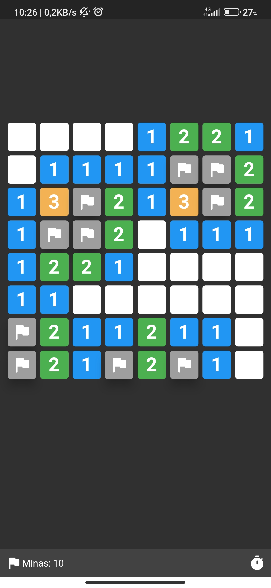
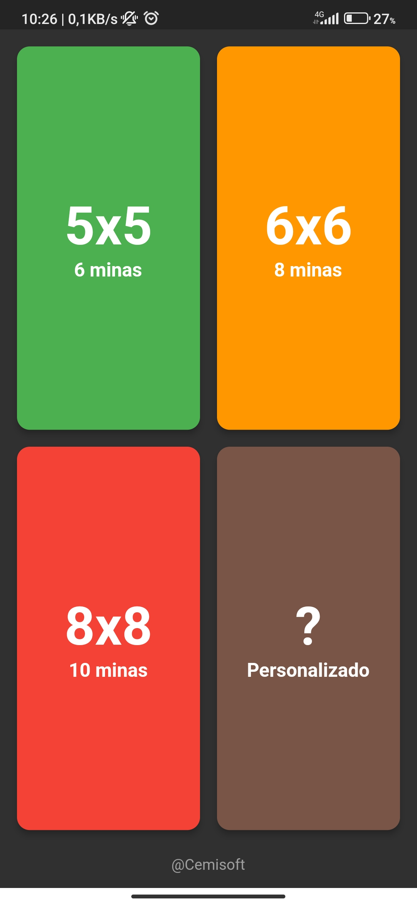
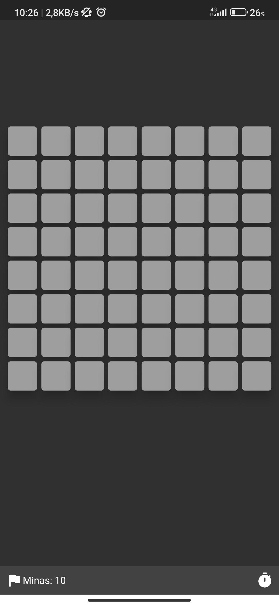

# Minas
### Minas es una apk escrita en flutter basada en Microsoft Minesweeper el clásico juego del Buscaminas de hace 20 años. Esta es una versión rediseña para jugar desde cualquier plataforma escrita completamente en Dart. Este legendario juego de puzles se puede jugar tocando una celda para descubrir casillas y marcar posibles puntos con minas.

